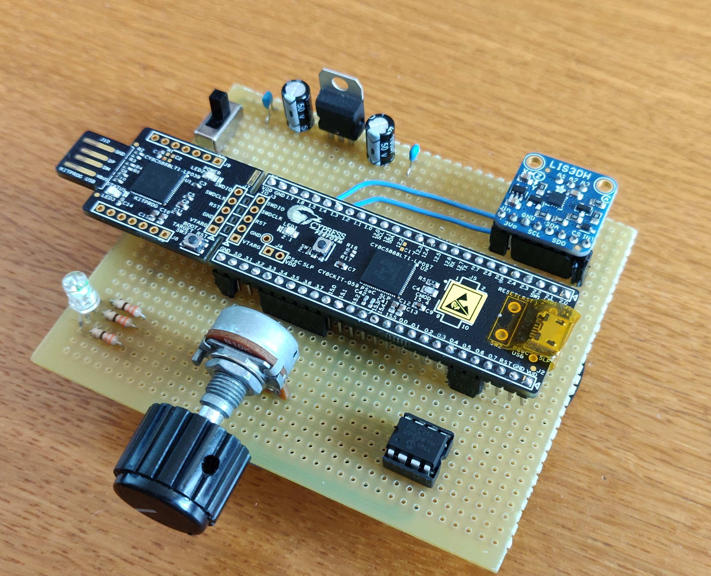

<p>

Electronic Technologies and Biosensors Laboratory<br>A.Y. 2019/2020 – II Semester
</p>
<br>

# PSoC Final Project
<p float="left" width=50%>
<b>Group #6:</b><br>
Manuel Carzaniga<br>
Lorenzo Gualniera<br>
</p>

<p float="right" width=50%>
<b>Project #2:</b><br>
Variant 2
</p>

In this project, students have to design and develop a system that controls the blinking frequency of an RGB LED based on the data read from the LIS3DH (3-axis accelerometer). Each channel of the sensor should control one color of the LED.
The main objectives of the project are:
- Acquire data from the accelerometer using its built-in FIFO to reduce the load of the CPU
- Process the raw acceleration data to control the blinking frequency of the RGB LED
- Provide the end user with a hardware menu to configure some settings related to the program
- Implement a hardware feedback for the configuration with the BLUE channel of the RGB LED to indicate the value of the parameter during the configuration mode.

## Harware design
Project components:
  1. [PSoC 5LP CY8C5888LTI-LP097](https://www.cypress.com/documentation/development-kitsboards/cy8ckit-059-psoc-5lp-prototyping-kit-onboard-programmer-and)
  2. [LIS3DH](https://cdn-learn.adafruit.com/assets/assets/000/085/846/original/lis3dh.pdf?1576396666) breakout board
  3. [25LC256](http://ww1.microchip.com/downloads/en/DeviceDoc/25AA256-25LC256-256K-SPI-Bus-Serial-EEPROM-20001822H.pdf) EEPROM
  4. Common anode RGB LED
  5. Resistors 330 Ohm (x3)
  6. Potentiometer 10k Ohm
  
Power supply components:
  1. Ceramic capacitors 1 nF (x2)
  2. Electrolytic capacitors 100 uF (x2)
  3. Voltage regulator LM7805
  4. On/off switch
  5. Alkaline battery 9V

>Prototype breadboard version:

<p align="center">

</p>


>Soldered battery powered version:

<p align="center">

</p>

<p align="center">

</p>

## Finite State Machine

<p align="center">

</p>

There are 3 main internal states:
* *STOP MODE*: 
  - LIS3DH data acquisition is stopped
  - On-board notification LED is turned off
  - External RGB LED is turned off
  
* *START MODE*: 
  - LIS3DH data acquisition is started,
  - The RGB LED is driven by processed inertial measurements from the IMU FIFO
  - On-board LED is turned on
  
* *CONFIG MODE*
  - LIS3DH data acquisition is stopped
  - User input is taken through the knob of a potentiomenter sampled by an ADC
  - RGB LED blue channel only is driven by the logical value of the flag set by the knob
  - Exiting this mode will resume the previous state

## Button controls:
Transitions between internal states, such as start, stop and configuration, are handled with either a quick double click or a long pression of the PSoC on-board button. The logic behind the button functioning has been designed completely in hardware in the top design of PSoC creator, as shown in the next schematic:

<p align="center">

</p>

## Over-threshold event logging

A local queue is kept in order to store 6 FIFO of LIS3DH data at a time, enqueing the newest FIFO and dequeing the oldest FIFO of data. 

<p align="center">

</p>

Whenever an over threshold event occurs this local queue is stored in the EEPROM as a log message of 5 pages (64 bytes each) structured as follow:
```
  +--------------------+
  |       Log ID       |      <1 byte>
  +--------------------+
  |    INT register    |      <1 byte>
  +--------------------+
  |      Timestamp     |      <2 bytes>
  +--------------------+
  |                    |
  |        Data        |      <60 bytes>
  |                    |
  +--------------------+
```

The overall data payload of 6 FIFO (576 bytes) is down sampled by 2 (288 bytes) to fit 5 pages of the EEPROM (except the last page that has only 60*5 - 288 = 48 bytes, the remaining 12 bytes are padded as zeros).
This permits to be consinstent in storing the same amount of samples (288 bytes --> 0.96s) at each over thresold event.

## Serial data plotting

The *SEND_FLAG* set by the user during *CONFIG* mode allows to send raw FIFO data stream over UART to the [Bridge Control Panel](https://www.cypress.com/documentation/software-and-drivers/psoc-programmer-secondary-software). The settings needed to plot the data correctly can be found inside *Bridge_Control_Panel* folder.

<p align="center">
  
</p>

## Remote EEPROM debugging
As an extra feature, a simple python script for debugging the EEPROM memory, with useful commands that interface with the PSoC using UART communication, is provided.

### Usage
- Install the requirements in /Python_Script/requirements.txt
    ```sh
    $ pip3 install -r requirements.txt
    ```
- Run the script in Python_Script folder
    ```sh
    $ python3 psoc.py
    ```
- Wait for automatic scanning for the serial port on which is connected the PSoC (make sure to have only one device connected, and that the port is free)
- Choose a command from the list:
   
    - R = reset logs in EEPROM memory and sets the Reset Flag in the control register to 1.
    - C = request control register status of the EEPROM.

        Reset flag | Send flag | Config Mode | Start/Stop Mode
        ------------ | ------------- | ------------- | -------------
        0 | 0 | 0 | 1
    - L = request specific log by ID, it will print on the terminal the header of the log and plot the data saved in the log.
        LOG_ID | Timestamp (s) | INT1_REG
        ------------ | ------------- | -------------
        2 | 105 | 0x56
        
        <p align="center">
        
        </p>

    - N = request number of logs stored in the EEPROM.
    >Before request a specific log, you have to request the number of stored log

## Demo

<p align="center">
  
</p>


## Disclaimer
- The python script should be supported on all major operating systems (windows, macOS, Linux), but it was tested on windows machines only.
- The python script is unable to work properly if the UART communication is flodded (i.e when the verbose flag *SEND_FLAG* is set to one allowing the IMU data transmission used for serial plotting).
